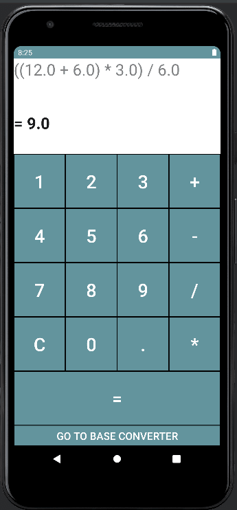

# Simple_Calculator
A Simple calculator in created in Android Studio! 
This calculator can do basic operations and retains the equation the user inputed. 
Currently adding a base converter

# Functionality
- Simple fully functional calculator
- Calculator can perform all the basic operations (add, subtract, multiply, divide)
- Calculator can take an expression as input and evaluate
- Calculator keeps track of and displays the users's mathematical expression as they use the calculator and calculates the expression as it is being inputted
- Plan to add more operations for it in the future, such as exponents, factorials, brackets, and a section dedicated to binary operations using 1's and 2's complement

# Pictures of App
 
